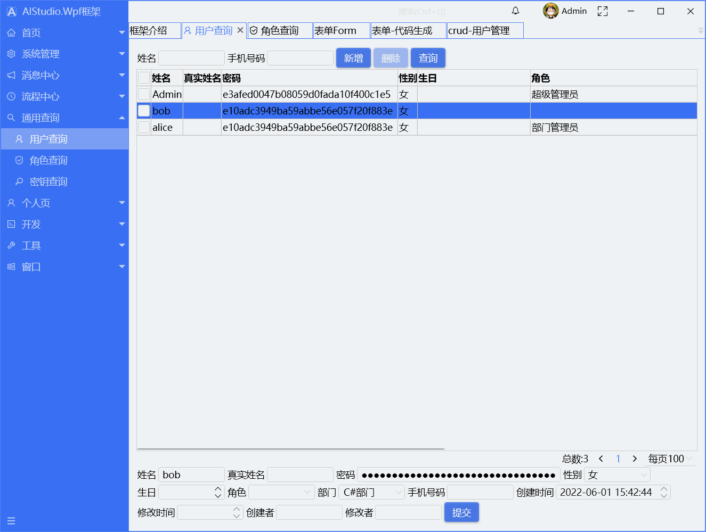

# AClient

写在前面，下载请选择net5-new的分支

使用的控件库地址https://gitee.com/akwkevin/AI-wpf-controls（麻烦大家点个星，谢谢大家）

#### 介绍
Wpf客户端，AIStudio.Wpf.AClient


#### 软件架构
本框架使用Prism做MVVM，优点咱就不说了，主要了容器注入，消息和DI，比自己写省很多事。网上有很多标准的MVVM的使用方法，但是没有形成一个系统级的框架。本框架从登录到具体业务的使用，还有自动升级都搭建完成，没有大神写的那么好，只是起个抛砖引玉的作用。
后端使用ASP.net core，采用的是Colder.Admin.AntdVue的框架，强烈推荐大家去看，我在其基础上增加了一些功能.
本项目使用的控件库Util.Controls也是开源的， **完全兼容MahApps.Metro** ，可以与MahApps.Metro同时使用，大家可在我的码云上下载。

其它技术特点：AOP,MAP

网页客户端浏览地址http://121.36.12.76:5001/ **(抱歉，已过期，请使用本地启动)** 
（账号密码：Admin，Admin）
接口浏览地址http://121.36.12.76:5000/swagger/index.html**(抱歉，已过期，请使用本地启动)** 

#### 快速预览
Wpf客户端下载可以直接运行，默认配置文件 AIStudio.Wpf.Client.exe.Config

```
<appSettings>
    <add key="Title" value="AIStudio" />
    <add key="Language" value="中文" />
    <add key="FontSize" value="16" />
    <add key="FontFamily" value="宋体" />
    <add key="Accent" value="BlueGray" />
    <add key="Theme" value="BaseGray11" />
    <add key="NavigationLocation" value="Left" />
    <add key="NavigationAccent" value="Dark" />
    <add key="TitleAccent" value="Normal" />
    <add key="ToolBarLocation" value="Top" />
    <add key="Version" value="1.0.20201115-rc3" />
    <add key="ServerIP" value="http://121.36.12.76:5000" />
    <add key="UpdateAddress" value="http://121.36.12.76:5000/update" />
  </appSettings>
```


 **快速预览方式1：** 其中ServerIP就是后台接口地址，http://121.36.12.76:5000可直接使用。**(抱歉，已过期，请使用本地启动)** 

账号密码：Admin，Admin。

 **快速预览方式2** ：不需要服务器，客户端直接使用SQLite本地数据，客户端独立运行。账号密码Admin, Admin
```
<add key="ServerIP" value=""/> 
<add key="UpdateAddress" value="http://121.36.12.76:5000/Update/AutoUpdater.xml"/>
<add key="ConString" value="Data Source=Admin.db"/>
<add key="DatabaseType" value="SQLite"/>
<add key="DeleteMode" value="Logic"/>
```
注释掉ServerIP，那么是使用efcore获取数据，改变ConString和DatabaseType即可。另外，默认数据库删除模式为软删除。

 **快速预览方式3** ：启动ServiceMonitor，点击启动服务，待本地服务启动后，可运行客户端进行连接。
```
<add key="ServerIP" value="http://localhost:5000" />
```


#### 登录界面

快速预览方式可直接在登录界面进行切换。


####  **框架截图** 


 **系统扩展** ：如果需要扩展自己的页面，只需要按照这个工程的目录进行扩展即可。


 ```
protected override void ConfigureModuleCatalog(IModuleCatalog moduleCatalog)
 {
    var homePageModule = typeof(HomePageModule);
    moduleCatalog.AddModule(new ModuleInfo()
    {
        ModuleName = homePageModule.Name,
        ModuleType = homePageModule.AssemblyQualifiedName,
        InitializationMode = InitializationMode.WhenAvailable
    });

    var base_ManageModule = typeof(Base_ManageModule);
    moduleCatalog.AddModule(new ModuleInfo()
    {
        ModuleName = base_ManageModule.Name,
        ModuleType = base_ManageModule.AssemblyQualifiedName,
        InitializationMode = InitializationMode.WhenAvailable
    });

    //在这里添加你新增的
}
```

####  **快速代码生成** ：

1.在数据库添加新表。

2.选择代码生成菜单，选中查询回来的新表，区域为你所加界面的工程，比如默认值Base_Manage，将把页面加到AIStudio.Wpf.Base_Manage工程下。

3.点击生成即可，重新启动客户端即可快速预览（前提是服务端也用代码生成器生成(在web端的代码生成器)了相应的控制器与接口）


#### 大屏界面（可拖拽，可全屏）


#### 3.0新增功能如下，2022-06-01

#### Form 表单

排列方式如下：
水平排列：WrapPanel
垂直排列：StackPanel
固定行列：UniformGrid

#### 表单-代码生成，是代码生成器的一种补充。


#### 通用crud方法1：

根据类直接生成DataGrid

#### 通用crud方法2：

读取数据库配置，生成DataGrid,完全不需要类，后台完成相关接口，wpd前台不需要更改任何代码，只需要在数据库插入脚本即可。

#### 技术交流
个人QQ:80267720
QQ技术交流群:51286643（进群提供服务端的开源代码地址）
个人博客:https://www.cnblogs.com/akwkevin/


#### 更多
界面截图请到博客介绍：https://www.cnblogs.com/akwkevin/p/14534441.html

相关介绍文章如下：

<section id="nice" data-tool="mdnice编辑器" data-website="https://www.mdnice.com" style="font-size: 16px; color: black; padding: 0 10px; line-height: 1.6; word-spacing: 0px; letter-spacing: 0px; word-break: break-word; word-wrap: break-word; text-align: left; font-family: Optima-Regular, Optima, PingFangSC-light, PingFangTC-light, 'PingFang SC', Cambria, Cochin, Georgia, Times, 'Times New Roman', serif;"><p data-tool="mdnice编辑器" style="font-size: 16px; padding-top: 8px; padding-bottom: 8px; margin: 0; line-height: 26px; color: black;"><a href="https://www.cnblogs.com/akwkevin/p/16297628.html" style="text-decoration: none; color: #1e6bb8; word-wrap: break-word; font-weight: bold; border-bottom: 1px solid #1e6bb8;">管理系统-Wpf客户端框架（OA，聊天，定时任务）3.0发布</a></p>
<p data-tool="mdnice编辑器" style="font-size: 16px; padding-top: 8px; padding-bottom: 8px; margin: 0; line-height: 26px; color: black;"><a href="https://www.cnblogs.com/akwkevin/p/14538305.html" style="text-decoration: none; color: #1e6bb8; word-wrap: break-word; font-weight: bold; border-bottom: 1px solid #1e6bb8;">1.Wpf客户端生成安装包与自动升级包 - 竹天笑 - 博客园 (cnblogs.com)</a></p>
<p data-tool="mdnice编辑器" style="font-size: 16px; padding-top: 8px; padding-bottom: 8px; margin: 0; line-height: 26px; color: black;"><a href="https://www.cnblogs.com/akwkevin/p/14946496.html" style="text-decoration: none; color: #1e6bb8; word-wrap: break-word; font-weight: bold; border-bottom: 1px solid #1e6bb8;">1.1搭建Wpf框架(2.1) —— Wpf客户端生成安装包与自动升级包2</a></p>
<p data-tool="mdnice编辑器" style="font-size: 16px; padding-top: 8px; padding-bottom: 8px; margin: 0; line-height: 26px; color: black;"><a href="https://www.cnblogs.com/akwkevin/p/14560284.html" style="text-decoration: none; color: #1e6bb8; word-wrap: break-word; font-weight: bold; border-bottom: 1px solid #1e6bb8;">2.Wpf实现打印报表 - 竹天笑 - 博客园 (cnblogs.com)</a></p>
<p data-tool="mdnice编辑器" style="font-size: 16px; padding-top: 8px; padding-bottom: 8px; margin: 0; line-height: 26px; color: black;"><a href="https://www.cnblogs.com/akwkevin/p/14586097.html" style="text-decoration: none; color: #1e6bb8; word-wrap: break-word; font-weight: bold; border-bottom: 1px solid #1e6bb8;">3.Wpf使用EFCore操作数据库 - 竹天笑 - 博客园 (cnblogs.com)</a></p>
<p data-tool="mdnice编辑器" style="font-size: 16px; padding-top: 8px; padding-bottom: 8px; margin: 0; line-height: 26px; color: black;"><a href="https://www.cnblogs.com/akwkevin/p/14587737.html" style="text-decoration: none; color: #1e6bb8; word-wrap: break-word; font-weight: bold; border-bottom: 1px solid #1e6bb8;">  4. 搭建Wpf框架(5) —— Wpf使用unity实现AOP - 竹天笑 - 博客园 (cnblogs.com)</a></p>
<p data-tool="mdnice编辑器" style="font-size: 16px; padding-top: 8px; padding-bottom: 8px; margin: 0; line-height: 26px; color: black;"><a href="https://www.cnblogs.com/akwkevin/p/14730269.html" style="text-decoration: none; color: #1e6bb8; word-wrap: break-word; font-weight: bold; border-bottom: 1px solid #1e6bb8;">5.搭建Wpf框架(6) —— Tile布局控件（可切换布局） - 竹天笑 - 博客园 (cnblogs.com)</a></p>
<p data-tool="mdnice编辑器" style="font-size: 16px; padding-top: 8px; padding-bottom: 8px; margin: 0; line-height: 26px; color: black;"><a href="https://www.cnblogs.com/akwkevin/p/14730309.html" style="text-decoration: none; color: #1e6bb8; word-wrap: break-word; font-weight: bold; border-bottom: 1px solid #1e6bb8;">6.搭建Wpf框架(7) —— 我的控制台（续6） - 竹天笑 - 博客园 (cnblogs.com)</a></p>
<p data-tool="mdnice编辑器" style="font-size: 16px; padding-top: 8px; padding-bottom: 8px; margin: 0; line-height: 26px; color: black;"><a href="https://www.cnblogs.com/akwkevin/p/14757287.html" style="text-decoration: none; color: #1e6bb8; word-wrap: break-word; font-weight: bold; border-bottom: 1px solid #1e6bb8;">7搭建Wpf框架(8) —— 3D展示墙 - 竹天笑 - 博客园 (cnblogs.com)</a></p>
<p data-tool="mdnice编辑器" style="font-size: 16px; padding-top: 8px; padding-bottom: 8px; margin: 0; line-height: 26px; color: black;"><a href="https://www.cnblogs.com/akwkevin/p/14757322.html" style="text-decoration: none; color: #1e6bb8; word-wrap: break-word; font-weight: bold; border-bottom: 1px solid #1e6bb8;">8搭建Wpf框架(9) —— 登录验证控件 - 竹天笑 - 博客园 (cnblogs.com)</a></p>
<p data-tool="mdnice编辑器" style="font-size: 16px; padding-top: 8px; padding-bottom: 8px; margin: 0; line-height: 26px; color: black;"><a href="https://www.cnblogs.com/akwkevin/p/14757355.html" style="text-decoration: none; color: #1e6bb8; word-wrap: break-word; font-weight: bold; border-bottom: 1px solid #1e6bb8;">9搭建Wpf框架(10) —— 弹出窗口动画 - 竹天笑 - 博客园 (cnblogs.com)</a></p>
<p data-tool="mdnice编辑器" style="font-size: 16px; padding-top: 8px; padding-bottom: 8px; margin: 0; line-height: 26px; color: black;"><a href="https://www.cnblogs.com/akwkevin/p/15069437.html" style="text-decoration: none; color: #1e6bb8; word-wrap: break-word; font-weight: bold; border-bottom: 1px solid #1e6bb8;">10.搭建Wpf框架(11) —— 多屏窗口</a></p>
<p data-tool="mdnice编辑器" style="font-size: 16px; padding-top: 8px; padding-bottom: 8px; margin: 0; line-height: 26px; color: black;"><a href="https://www.cnblogs.com/akwkevin/p/15070640.html" style="text-decoration: none; color: #1e6bb8; word-wrap: break-word; font-weight: bold; border-bottom: 1px solid #1e6bb8;">11.搭建Wpf框架(12) —— MahApps2.0.0.0自定义主题</a></p>
<p data-tool="mdnice编辑器" style="font-size: 16px; padding-top: 8px; padding-bottom: 8px; margin: 0; line-height: 26px; color: black;"><a href="https://www.cnblogs.com/akwkevin/p/16297568.html" style="text-decoration: none; color: #1e6bb8; word-wrap: break-word; font-weight: bold; border-bottom: 1px solid #1e6bb8;">12.一个Wpf控件库（Wpf客户端框架使用） - 竹天笑 - 博客园 (cnblogs.com)</a></p>
<p data-tool="mdnice编辑器" style="font-size: 16px; padding-top: 8px; padding-bottom: 8px; margin: 0; line-height: 26px; color: black;"><a href="https://www.cnblogs.com/akwkevin/p/16387680.html" style="text-decoration: none; color: #1e6bb8; word-wrap: break-word; font-weight: bold; border-bottom: 1px solid #1e6bb8;">13.为Wpf敏捷开发做准备-Wpf实现Form表单1 - 竹天笑 - 博客园 (cnblogs.com)</a></p>
<p data-tool="mdnice编辑器" style="font-size: 16px; padding-top: 8px; padding-bottom: 8px; margin: 0; line-height: 26px; color: black;"><a href="https://www.cnblogs.com/akwkevin/p/16387731.html" style="text-decoration: none; color: #1e6bb8; word-wrap: break-word; font-weight: bold; border-bottom: 1px solid #1e6bb8;">14.为Wpf敏捷开发做准备-Wpf实现Form表单2 - 竹天笑 - 博客园 (cnblogs.com)</a></p>
<p data-tool="mdnice编辑器" style="font-size: 16px; padding-top: 8px; padding-bottom: 8px; margin: 0; line-height: 26px; color: black;"><a href="https://www.cnblogs.com/akwkevin/p/16387851.html" style="text-decoration: none; color: #1e6bb8; word-wrap: break-word; font-weight: bold; border-bottom: 1px solid #1e6bb8;">15.搭建Wpf框架(13) ——代码生成器的使用 - 竹天笑 - 博客园 (cnblogs.com)</a></p>
<p data-tool="mdnice编辑器" style="font-size: 16px; padding-top: 8px; padding-bottom: 8px; margin: 0; line-height: 26px; color: black;"><a href="https://www.cnblogs.com/akwkevin/p/16387912.html" style="text-decoration: none; color: #1e6bb8; word-wrap: break-word; font-weight: bold; border-bottom: 1px solid #1e6bb8;">16.搭建Wpf框架(14) ——代码生成器的补充（Form表单的拖拽及生成） - 竹天笑 - 博客园 (cnblogs.com)</a></p>
<p data-tool="mdnice编辑器" style="font-size: 16px; padding-top: 8px; padding-bottom: 8px; margin: 0; line-height: 26px; color: black;"><a href="https://www.cnblogs.com/akwkevin/p/16388086.html" style="text-decoration: none; color: #1e6bb8; word-wrap: break-word; font-weight: bold; border-bottom: 1px solid #1e6bb8;">17.搭建Wpf框架(15) ——敏捷开发crud界面的设计 - 竹天笑 - 博客园 (cnblogs.com)</a></p>
<p data-tool="mdnice编辑器" style="font-size: 16px; padding-top: 8px; padding-bottom: 8px; margin: 0; line-height: 26px; color: black;"><a href="https://www.cnblogs.com/akwkevin/p/16388122.html" style="text-decoration: none; color: #1e6bb8; word-wrap: break-word; font-weight: bold; border-bottom: 1px solid #1e6bb8;">18.搭建Wpf框架(16) ——敏捷开发crud界面终极版（通过数据库脚本配置，前台无需修改） - 竹天笑 - 博客园 (cnblogs.com)</a></p>
</section>